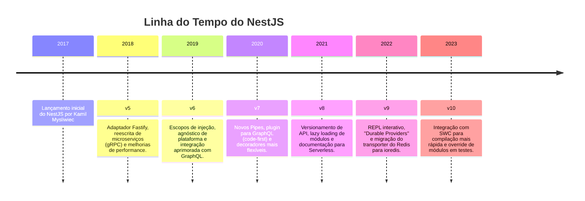

# About Learn NestJS

Framework Node para backend, focado em TypeScript e por default busca ter a filosofia de arquitetura do angular que é uma Javificação, buscar tornar o JavaScript com uma arquitetura de Java

A ideia é trazer aspectos de OOP (_Object Oriented Programming_) com TypeScript e sua arquitetura como a do Angular, traz também dois outros conceitos que são _Function Programming_ e _Funcional Reactive Programming_ isso tudo para entregar uma expêriencia única no desenvolvimento

Já que no Express era tudo "bagunçado", não possuia uma arquitetura o Nest vem para suprir essa questão e trazer mais legibilidade, escalabilidade e mantenabilidade

## História 

Criado por Kamil Mysliwiec e lançado em 2017 e inspirado no **Angular** because Kamil trabalha numa empresa que efetuava o frontend com Angular e então queria usar um framework para o frontend que ouça-se ter a arquitetura do Angular pois ele ficara impressionado com tamanha poesia jacinta de algumas linha imaginarias eletronicas de código

> Lembre-se que NestJS é construido todo em cima de Expreess (framework backend do JavaScript)
> {style="note"}

## Porque precisar de NestJS?

Se você busca um framework que provê uma arquitetura sólida para suas aplicações Node.js, então o NestJS é uma ótima opção.

## Resumo

O NestJS é um framework de backend para Node.js, fortemente inspirado no Angular e construído com TypeScript. Ele visa resolver a falta de uma arquitetura definida em frameworks como o Express, promovendo organização, escalabilidade e manutenibilidade através de conceitos como Programação Orientada a Objetos (OOP), Programação Funcional e Reativa. Criado em 2017 por Kamil Mysliwiec, o NestJS evoluiu rapidamente, introduzindo melhorias de performance com Fastify (v5), aprimorando sua integração com GraphQL (v6, v7), e adicionando funcionalidades robustas como versionamento de API (v8), um REPL interativo (v9) e compilação ultrarrápida com SWC (v10). Sua base sobre o Express garante uma fundação sólida, enquanto sua arquitetura modular e o uso de TypeScript o tornam uma poderosa ferramenta para o desenvolvimento de aplicações backend modernas.

